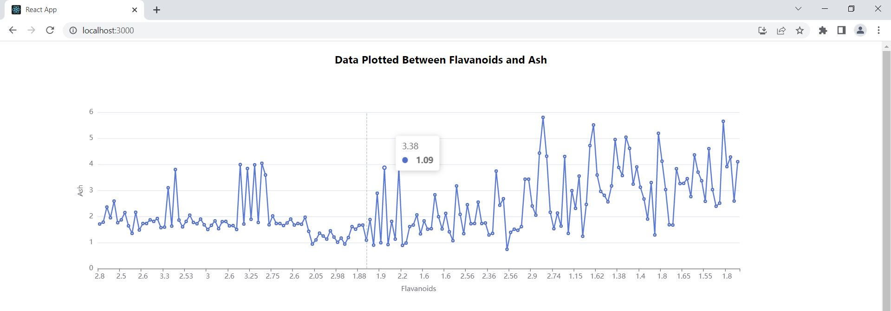
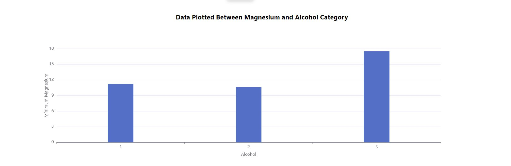
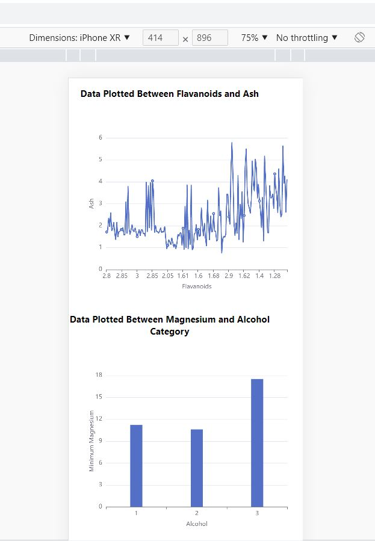

# Line and Bar Chart Rendered

### Live Link : https://main--rad-arithmetic-1b63e0.netlify.app/

## Sample Outputs of the Line and Bar Chart

### Line Graph Laptop



### Bar Graph Laptop



### Line & Bar Graph iPhone XR



# How to Run the Project

## Step 1: Clone the repository

To clone a GitHub repository, open a terminal or command prompt and navigate to the directory where you want to store the project. Then, run the following command:

https://github.com/ankanmal/manufac-analysis.git

## Step 2: Install the required libraries

After cloning the repository, navigate to the project directory and run the following command to install the required libraries using `yarn`:

```
yarn install
```

## Step 3: Run the project

After installing the required libraries, you can run the project by running one of the following commands:

```
yarn start
```

## Available Scripts

In the project directory, you can run:

### `yarn test`

Launches the test runner in the interactive watch mode.\
See the section about [running tests](https://facebook.github.io/create-react-app/docs/running-tests) for more information.

### `yarn build`

Builds the app for production to the `build` folder.\
It correctly bundles React in production mode and optimizes the build for the best performance.

The build is minified and the filenames include the hashes.\
Your app is ready to be deployed!

See the section about [deployment](https://facebook.github.io/create-react-app/docs/deployment) for more information.
